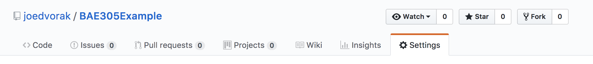
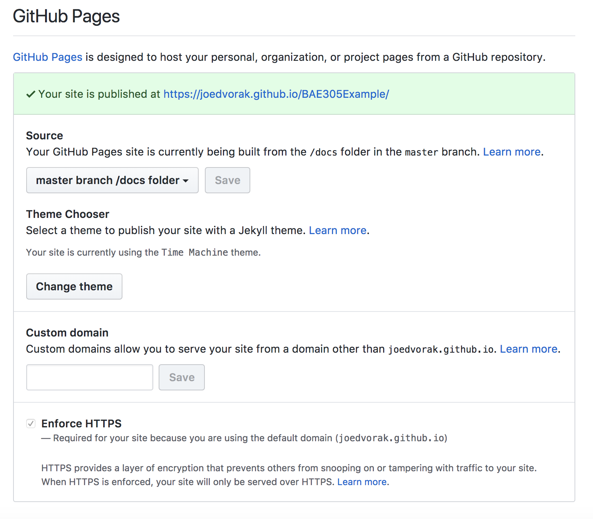

# Getting Started

## Creating a new project
1. In GitHub: Login, Click on your name. Click on repositories. Click on the green button that says New.

2. Open GitHub Desktop. Click File->Clone Repository...

3. Select your new project from the list.

4. Congratulations! You now have a GitHub project. If you click on Repository in the menu bar, you can select Options to Open in Atom or Open in Finder/File Manger.


1. Create the /docs folder in your project
2. Add a README.md file to the folder.
3. Goto the settings section of your project:

4. Scroll down to the GitHub Pages section:

5. Set the Source to master branch /docs folder and click Save
6. Choose your theme from the next button. This sets a theme and creates a \_config.yml file.
7. Edit the \_config.yml file to set the title and description of the GitHub Page. The \_config.yml file for this project's GitHub Page is:

```
theme: jekyll-theme-time-machine
title: BAE 305 Example Project
description: This is just an example based on a project from a previous year.
```

8. Start editing your README.md file to create your website.
9. Do the editing online at GitHub to get nice formatting tools.
