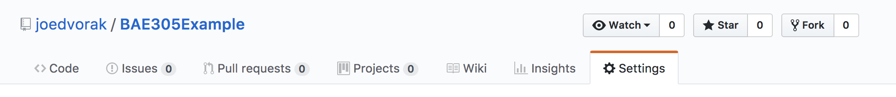

# Helpful Hints for creating your GitHub Pages Design File
* Keep all files such as images used in your design file in a single folder called ""/docs"
* Create a file named "README.md" in the "/docs" folder
* Edit the README.md file with GitHub's editor. You can preview the final document by clicking on the tab at the top.
* The preview lets you check formatting, but the final webpage can only be checked by going to the link for the GitHub Pages.
* There can be delays before the GitHub pages completely updates.
* Make sure to save your online edits by clicking commit at the bottom.
* The GitHub wiki uses the same Markdown language for formatting. There are extra formatting buttons on the wiki editor. If you want to use the formatting buttons, just draft the file as a wiki page and then copy it to README.md when you are finished.
* The wiki is just a section of your project like the code section. Click the tabs to switch to it.


* At the top of the wiki editor is a "?" that you can click for help.
* The wiki formatting buttons can also help.


* Resize images before uploading to the /docs folder. You can use any image editor for that. I set mine a maximum of 3 inches high so that they appear on the screen easily.
* The programming language type for README.md is Markdown.
* You will likely need a space before hitting enter at the end of a line. This helps the interpreter recognize different paragraphs.
* If you see sections that run onto each other. Try a space before the enter. If that doesn't work, try adding an extra blank line (hit enter again). That helps separate sections.
* Markdown elimnates extra blank lines between paragraphs so don't worry about having too many.
* Insert images using \!\[*image alt text*](*filename*). 
* If you have spaces in your image name replace them with %20.
* Download this file or the README.md in this project's /docs directory to see an example of formatting.
* The GitHub pages section also shows you the link to your page!

# Getting Started
1. Create the /docs folder in your project
2. Add a README.md file to the folder.
3. Goto the settings section of your project:

4. Scroll down to the GitHub Pages section:

5. Set the Source to master branch /docs folder and click Save
6. Choose your theme from the next button. This sets a theme and creates a \_config.yml file.
7. Edit the \_config.yml file to set the title and description of the GitHub Page. The \_config.yml file for this project's GitHub Page is:

```
theme: jekyll-theme-time-machine
title: BAE 305 Example Project
description: This is just an example based on a project from a previous year.
```

8. Start editing your README.md file to create your website.

# Formatting Code

Markdown has several ways to represent code. The basic code button in the Wiki editor just puts it in a gray box and all on one line. It's not too useful. To get the nice syntax highlighting you have to tell the Markdown interpreter the programming language. Arduino is very similar to C or C++ so the following can be used to designate code:

Basic code notation using the button (i.e. \' code \'): 

`
void setup(){
int myNumber = 3;
Serial.begin(9600);
myNumber++;
}
`

The above code was written on separate lines but was combined in the output.

Basic code notation using the triple \` (\```): 

```
void setup(){
int myNumber = 3;
Serial.begin(9600);
myNumber++;
}
```

Using C notation:

```C
void setup(){
int myNumber = 3;
Serial.begin(9600);
myNumber++;
}
```

Using C++ notation:

```C++
void setup(){
int myNumber = 3;
Serial.begin(9600);
myNumber++;
}
```

Using Arduino notation:
```Arduino
void setup(){
int myNumber = 3;
Serial.begin(9600);
myNumber++;
}
```

All three look the same! However, I don't suggest using Arduino notation as it sometimes isn't handled well.

How do you tell it the notation to use?
Write the code section like this:

```Markdown
```C
void setup(){
int myNumber = 3;
Serial.begin(9600);
myNumber++;
}
\```
```

Don't put a slash at the start of the triple \` at the end. It is only here to make sure the \``` prints on the screen.

More about highlighting code is [here](https://help.github.com/articles/creating-and-highlighting-code-blocks/). You might need to look it up if you decide to use something other than Arduino for your project. 
